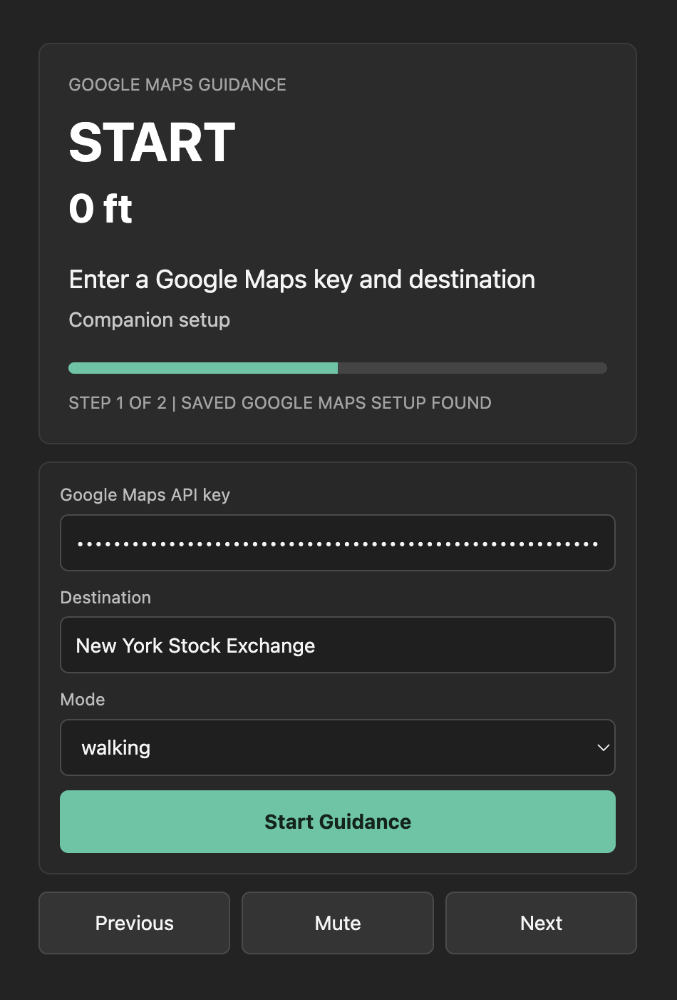
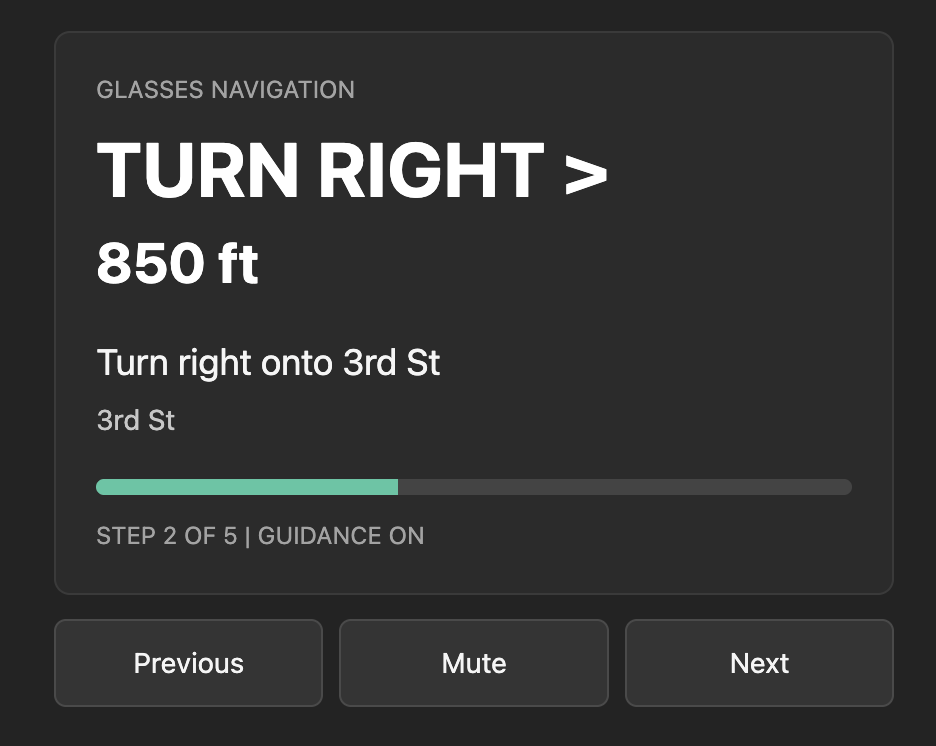

# AR glasses GPS guidance

Navigation app for Even Realities glasses, built on the Even Hub SDK. It targets the Even G2 glasses flow with Vite + TypeScript + SDK + CLI + simulator, a glasses-first turn-by-turn route display, Google Maps Directions hookup, live GPS step advancement, and companion controls for testing.

## Screenshots

Start guidance from the companion view:



Follow the active turn-by-turn display:



## How it works

The app runs as an Even Hub WebView companion app for Even Realities glasses and renders a compact guidance UI to the lenses with SDK text containers. The companion view collects a Google Maps API key, destination, and travel mode, then starts a route from the phone's current location.

On startup, `src/main.ts` creates five glasses containers: route summary, maneuver, step details, progress, and footer status. After guidance starts, the app loads Google Maps JavaScript, requests the phone location through WebView geolocation, asks Google Directions for a route, converts each route step into glasses-friendly instructions, and updates the glasses display.

While guidance is active, GPS updates can advance to the next step when the phone gets close to the current step endpoint. The app also reroutes after meaningful movement so the displayed directions stay fresh. Manual controls remain available for demos and simulator testing.

## Run

```bash
npm install
npm run dev
```

Then either:
- **Simulator:** `npm run simulate`
- **Real glasses:** `npx evenhub qr --url http://<your-ip>:5173` and scan with the Even Hub companion app.

## Google Maps setup

1. Create a browser-restricted Google Maps Platform API key.
2. Enable **Maps JavaScript API** and **Directions API** for the key's project.
3. Run the app, paste the key into the companion view, enter a destination, pick a travel mode, and tap **Start Guidance**.

The API key is stored only in this browser's `localStorage`; it is not committed to the repo.

The packaged app requests Even Hub `location` permission plus `network` access to `https://maps.googleapis.com` and `https://maps.gstatic.com`. During local sideloading, WebView geolocation may still require a secure origin; if a LAN `http://` QR URL refuses location, retry with an HTTPS dev URL or test a packaged build.

## Controls

- **Tap:** manually advance to the next navigation step
- **Scroll down:** advance to the next navigation step
- **Scroll up:** go back one step
- **Double-tap:** exit the app
- **Companion view:** start a live Google Maps route, then use Previous, Mute, and Next while testing

## Pack for distribution

```bash
npm run pack
```

Produces an `.ehpk` file.

## What's in here

| File | Purpose |
|---|---|
| `index.html` | WebView host. Viewport meta tag locks zoom; CSS kills iOS double-tap zoom + rubber-band scroll. |
| `src/main.ts` | Creates navigation text containers, loads Google Maps, converts Directions steps to glasses guidance, watches GPS, and handles tap/scroll lifecycle events. |
| `app.json` | Even Hub manifest with location and Google Maps network permissions. |
| `tsconfig.json` | Standard Vite vanilla-ts config. |
| `vite.config.ts` | Dev server on port 5173, host binding for LAN QR access. |

## Next steps

- Add production key provisioning instead of manual key entry.
- Move Google Maps calls behind a small backend if browser key exposure is not acceptable for production.
- Add image containers if you want map tiles or lane diagrams.
